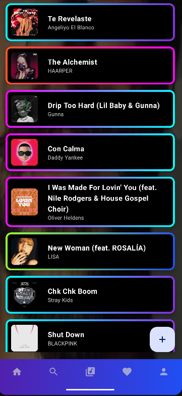
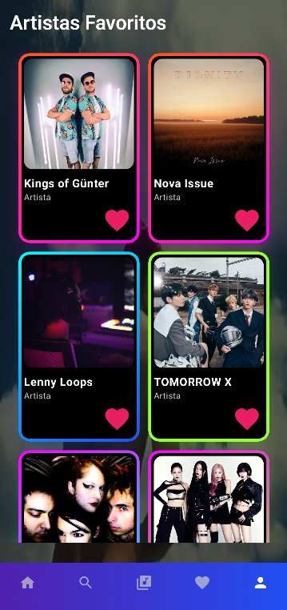

<h1 align="center">Hola, soy Gelen 🙋‍♀️</h1>

 

 Soy una apasionada del desarrollo de aplicaciones 🚀 en constante aprendizaje 📚.  

 Me encanta aprender nuevas tecnologías 🧠 y expandir mis conocimientos 👩‍💻. 

## 🛠️ Entre mis habilidades puedo destacar:

- 💻 Lenguajes como **Java**, **Kotlin**, **C#** (para desarrollo en Unity) y **TypeScript**  
- 🗄️ Gestión de bases de datos como **PostgreSQL** y **MySQL**  
- 🧱 Frameworks como **Spring Boot** y **Jetpack Compose**  
- 🧰 Entornos de desarrollo como **Android Studio**, **Visual Studio**, **Unity** y **Eclipse**

## Puedes explorar mas de mi trabajo *A continuación ⬇️*
<table>
<tr>
  <td width="50%">
     <h3 align="center">Melodix</h3>
     

  
  

    Este es mi proyecto de fin de grado: un reproductor de música que permite explorar contenido desde Spotify y reproducirlo desde YouTube. 
    También puedes guardar tus canciones y artistas favoritos, y crear listas de reproducción personalizadas. 🎧🎵🌈
  

                                                                            
  </td>
</tr>
</table>

<h1 align="center"> ⚙️ &nbsp;GitHub Analytics </h1>

## 💬 Información De Contacto  
✉ [Email](mailto:gelenc08@gmail.com)
🌐 [LinkedIn](https://www.linkedin.com/in/gelen-cueto-3a31a0310/)  
📱 [Instagram (por si acaso)](https://www.instagram.com/gelen.cueto/)

